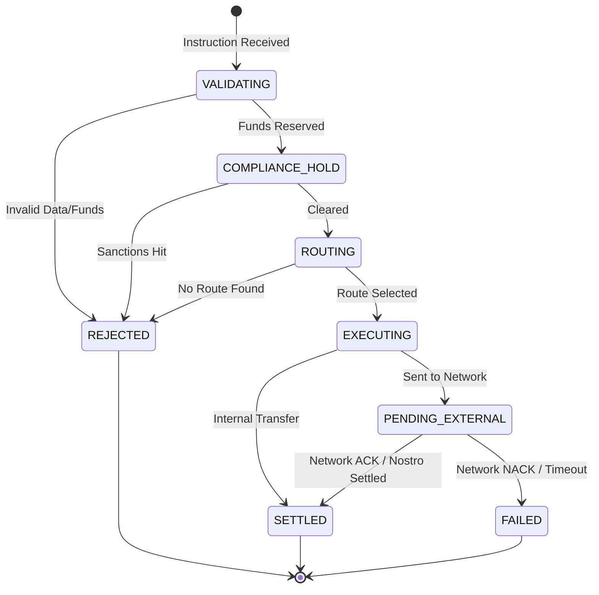
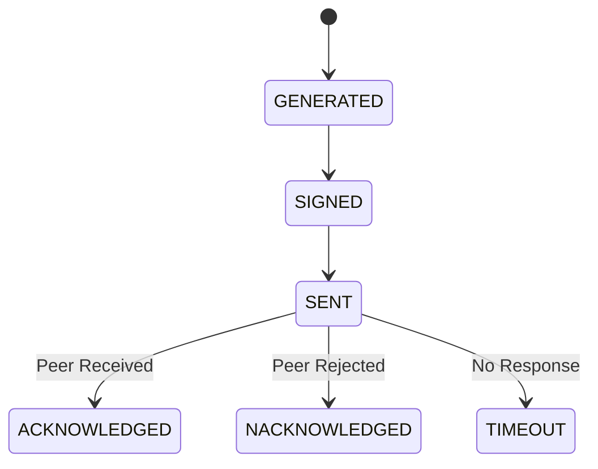

# CrossPayNet Domain Model Refinement

This document defines the rigorous conceptual domain model for CrossPayNet, independent of any implementation technology. 

---

## 1. Entity vs. Value Object Classification

We must distinguish between concepts that have an ongoing lifecycle/identity (**Entities**) and concepts defined solely by their attributes (**Value Objects**).

### Value Objects
*Why primitive types are weaker*: A primitive string cannot guarantee it is a valid BIC. A primitive decimal cannot prevent adding USD to EUR.
* **Money**: (Amount, Currency). Immutable. Equality is based on exact value match. Arithmetic operations yield a *new* Money object.
* **Currency**: (Code, Exponent). Immutable. 
* **BIC (Bank Identifier Code)**: Encapsulates validation rules for 8 or 11-character SWIFT codes.
* **AccountNumber**: Encapsulates IBAN or domestic account validation logic.
* **PaymentReference**: A string adhering to specific network formatting rules, protecting against injection or truncation.

### Entities
*Identity matters regardless of attribute changes.*
* **Customer**: Can change their address, but remains the same Customer.
* **Account**: Balance changes, but it remains the same Account.
* **Payment**: Progresses through a state machine, maintaining the same Payment ID.
* **PaymentMessage**: Represents a specific physical transmission attempt.
* **Ledger**: The systemic record keeper.

---

## 2. Critical Payment Distinctions

A common pitfall is conflating the intent, the orchestration, the transmission, and the accounting. CrossPayNet separates these strictly:

1. **Payment Instruction**: *What it IS*: The raw, unvalidated intent from a Customer. *What it is NOT*: A financial liability. *Who creates it*: The Customer (via API).
2. **Payment**: *What it IS*: The bank's internal orchestrator/state machine. *What it is NOT*: The message sent to another bank. *Who creates it*: The Payment Engine (after validating the Instruction).
3. **Payment Message**: *What it IS*: The physical artifact (e.g., ISO 20022 `pacs.008`) sent over the wire. *What it is NOT*: The Payment orchestration. *Why separate*: If a network link drops, we generate a *new* Message for the *same* Payment via a different route.
4. **Settlement**: *What it IS*: The inter-bank accounting effect. *What it is NOT*: The customer-facing balance update.
5. **Ledger Entry**: *What it IS*: The intra-bank accounting effect.

*Conceptual Flow*:
`Customer` -> submits -> `Instruction` -> validates into -> `Payment` -> generates -> `Message` -> results in -> `Settlement` (via `Ledger Entries`).

---

## 3. Aggregate Boundaries

An aggregate is a transactional consistency boundary. Things inside an aggregate must be strictly consistent immediately. Things crossing aggregates can be eventually consistent.

### The Ledger Aggregate
* **Root**: `Ledger`
* **Contains**: `LedgerEntry`, `LedgerTransaction`
* **Must remain outside**: `Account` status, `Payment` details.
* **Invariants protected**: A `LedgerTransaction` must contain $\ge$ 2 `LedgerEntries` where sum of debits == sum of credits. 
* **Why this boundary**: Ensures money is never created or destroyed mathematically.

### The Payment Aggregate
* **Root**: `Payment`
* **Contains**: `PaymentLegs`, `PaymentStatusHistory`
* **Must remain outside**: `ComplianceCheck` rules, `PaymentMessage`.
* **Invariants protected**: A Payment cannot transition to `ROUTING` unless `COMPLIANCE` has explicitly passed. 
* **Why this boundary**: Protects the state machine of the transfer.

### The Account Aggregate
* **Root**: `Account`
* **Contains**: `AccountStatus`, `Limits`
* **Must remain outside**: The actual `LedgerEntries`.
* **Invariants protected**: An account cannot be debited if its status is `FROZEN`.
* **Why this boundary**: Separates operational rules (limits, freezing) from immutable ledger math. *(Note: The Account caches the derived balance for fast reads, but the Ledger is the source of truth).*

---

## 4. Account, Ledger, and Settlement Model

* **The Relationship**: An `Account` does not independently hold a balance. The balance is functionally a derivation of all `LedgerEntries` pointing to that Account.
* **Immutability**: A `LedgerEntry`, once committed, is mathematically immutable. To correct an error, a new compensating entry must be posted.
* **Settlement**: Settlement is modeled as a specific type of `LedgerTransaction` occurring on Nostro/Vostro accounts (bank-to-bank accounts) rather than customer accounts. 

---

## 5. Compliance and Risk Model

* **Compliance Check**: Modeled as a separate domain concept (potentially its own aggregate later). A `Payment` requests a check asynchronously. The `Compliance` domain owns the rules (Sanctions lists) and returns a domain event (`ComplianceCleared` or `ComplianceBlocked`).
* **Risk Assessment**: A value generated by an external AI model. It does not pause the payment directly; rather, the `Payment` aggregate evaluates the returned Risk Assessment score against its own policies.

---

## 6. Payment Lifecycle (Business State Machine)

This machine represents true business states, removing temporary technical states.

*Note: `EXECUTING` means the bank has committed to the transfer. `FAILED` represents a failure after commitment, requiring a compensating Ledger transaction (Return). `REJECTED` means the payment was stopped before execution.*

---

## 7. Payment Message Lifecycle

The message has a strictly technical lifecycle distinct from the Payment.

---

## 8. Domain Invariants vs. Rules

* **Domain Invariant (Strict)**: *Ledger Balance Neutrality*. Sum of entries in a transaction must equal zero. (Enforced by `Ledger` Aggregate).
* **Domain Invariant (Strict)**: *Payment Progression*. A payment cannot settle if compliance is pending. (Enforced by `Payment` Aggregate).
* **Security/Authorization Rule (Cross-cutting)**: Only a user with `ROLE_TELLER` can override a risk hold. (Enforced by application security layer, not the domain model).
* **Operational Rule (Configurable)**: Cross-border payments over $10,000 require manual review. (Enforced by business rule engine).

---

## 9. Domain Events

These represent genuine business facts that have occurred, used to communicate across aggregate boundaries.

* `PaymentInstructionReceived`: Fact that a customer requested a move.
* `FundsReserved`: Fact that the Ledger successfully held funds for a Payment.
* `ComplianceCleared`: Fact that the Compliance domain approved the entity.
* `PaymentSentToNetwork`: Fact that a Message was physically dispatched.
* `PaymentSettled`: Fact that the final accounting effect is complete.

*(Excluded: Technical events like `DatabaseUpdated` or `MessageQueued`).*

---

## 10. Module Mapping (Future Boundaries)

We map these aggregates to candidate logical modules for our Evolutionary Modular Monolith:

1. **Banking Module**: Owns `Customer`, `Account`, limits, and KYC status.
2. **Ledger Module**: Owns `Ledger`, `LedgerTransaction`, `LedgerEntry`.
3. **Payment Module**: Owns `PaymentInstruction`, `Payment` orchestration.
4. **Network/Messaging Module**: Owns `PaymentMessage`, `Route`, parsing ISO 20022.
5. **Compliance Module**: Owns `ComplianceCheck`, Sanctions lists.

---

## 11. Cross-Aggregate Interactions

How boundaries communicate conceptually:

* **Payment $\rightarrow$ Ledger (Funds Reservation)**: 
  * *Interaction*: Payment issues a command to Ledger to reserve funds. 
  * *Consistency*: Synchronous/Immediate. The Payment cannot proceed if funds don't exist.
* **Payment $\rightarrow$ Compliance**: 
  * *Interaction*: Payment publishes `PaymentCreated` event. Compliance listens, checks rules, publishes `ComplianceCleared`.
  * *Consistency*: Eventual. Payment waits in `COMPLIANCE_HOLD` state.
* **Payment $\rightarrow$ Network**: 
  * *Interaction*: Payment commands Network to dispatch. Network responds asynchronously via events when ACK/NACK is received.

---

## 12. Unresolved Domain Questions
1. **Exchange Rates**: At what precise state transition is the FX rate locked for a cross-currency payment?
2. **Settlement Finality**: If a correspondent bank acknowledges a message but fails before settling the Nostro account, does the Payment aggregate transition to `FAILED` or `SETTLED_WITH_DISPUTE`?
