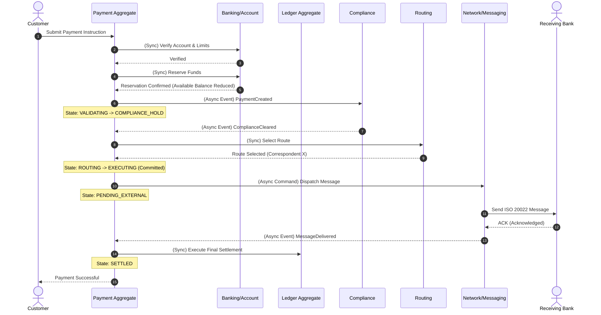
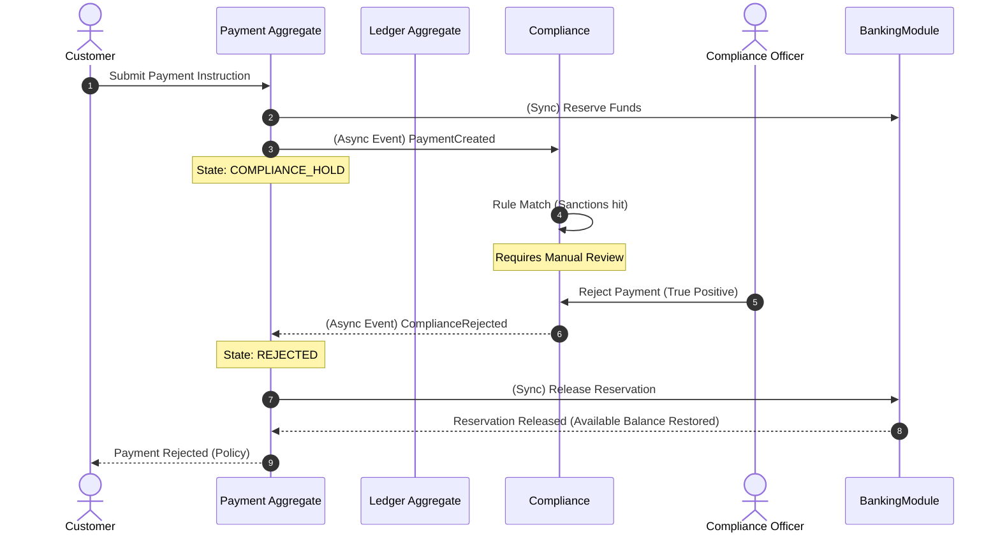
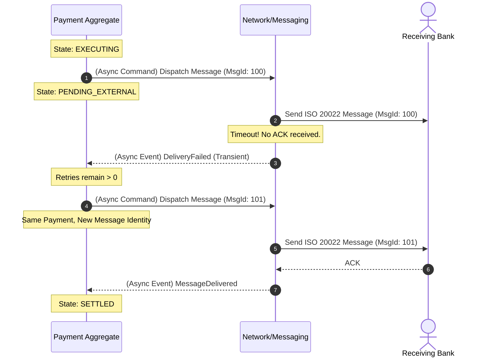

# Interaction Flows

This document visualizes the conceptual interactions across domain boundaries (aggregates/modules) for key scenarios in CrossPayNet. It highlights synchronous vs. asynchronous communication and branches for failure paths.

---

## Flow 1: Successful Cross-Border Payment

This represents the "Happy Path" where a customer initiates a payment that clears compliance, routes successfully, and settles.

---

## Flow 2: Payment Rejection via Compliance Hold

This flow demonstrates what happens when a payment is rejected before the bank financially commits to it.

---

## Flow 3: Network Timeout and Internal Retry

This flow demonstrates how the system handles transient network failures without requiring the user to submit a new payment, distinguishing network retries from duplicate submissions.

---

## Failure Branches Summary

*   **Scenario A: Insufficient funds**: Fails at Step 4 of Flow 1. The `Banking` aggregate rejects the synchronous reservation command. The Payment immediately transitions to `REJECTED`.
*   **Scenario E: No valid routing relationship**: Fails at Step 8 of Flow 1. The `Payment` cannot be routed. It transitions to `REJECTED`, and the synchronous release of reserved funds is triggered at the `Banking` module.
*   **Scenario I: Settlement Failure (Post-Delivery)**: If the `NetworkModule` receives an ACK, the payment is effectively `SETTLED` from the customer's perspective. If the correspondent bank later fails to clear the Nostro account, this creates a reconciliation break in the `Ledger`. The Payment itself is not rolled back; instead, an Operations Analyst must resolve the dispute manually or initiate a compensating accounting entry.
